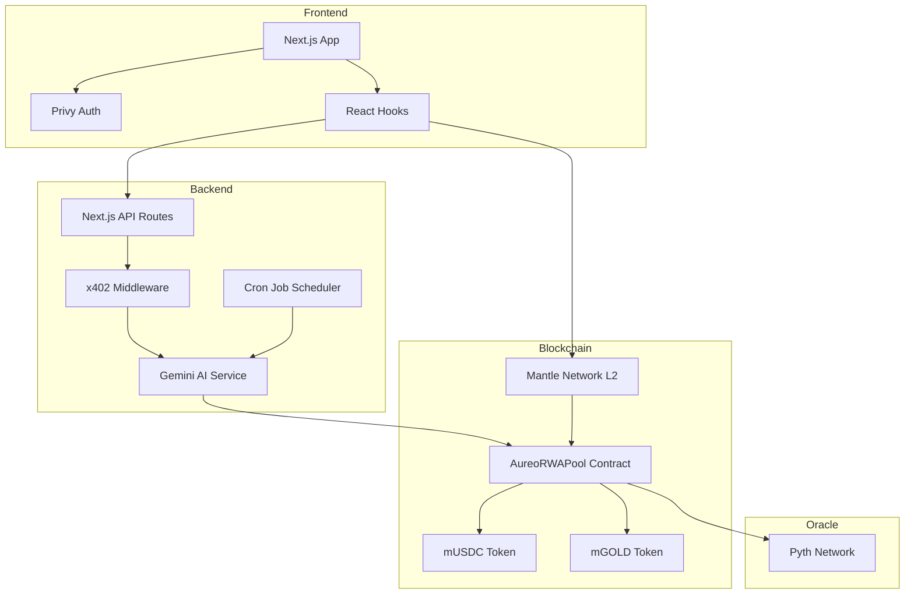
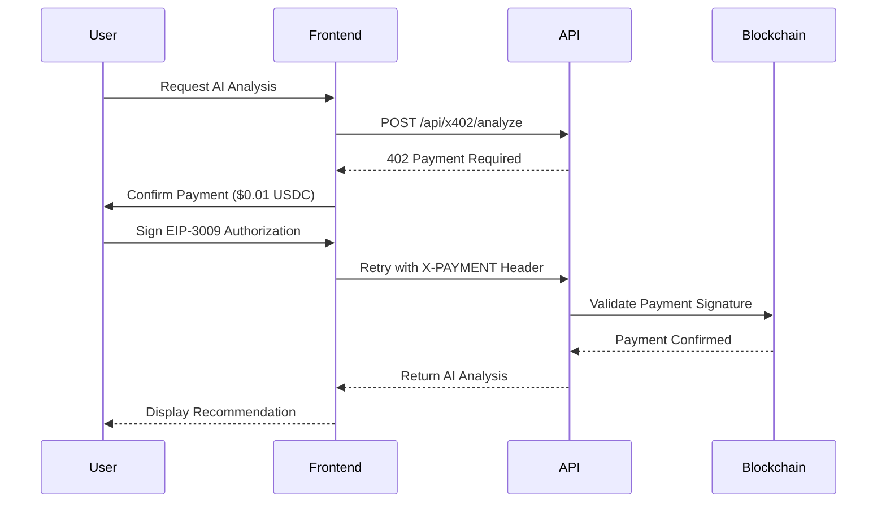

# Aureo

**AI-Powered Gold Investment Platform**

Aureo democratizes gold investment through blockchain tokenization and AI-driven automation. Built on Mantle Network with real-time Pyth oracle pricing and x402 pay-per-use micropayments.

---

## Quick Links

| Resource          | Link                                                                                                                                                                                     |
| ----------------- | ---------------------------------------------------------------------------------------------------------------------------------------------------------------------------------------- |
| Documentation     | [GitBook](https://aureo-new.gitbook.io/aureo/documentation)                                                                                                                              |
| Pitch Deck        | [Canva](https://www.canva.com/design/DAG8iFeU5kE/XBRNw3Rky0aQeMxQL89TmQ/view?utm_content=DAG8iFeU5kE&utm_campaign=designshare&utm_medium=link2&utm_source=uniquelinks&utlId=h546e0d87b2) |
| GitHub Repository | [Nicholandn22/Aureo](https://github.com/Nicholandn22/Aureo)                                                                                                                              |
| Live Demo         | [aureo-hackathon.vercel.app](https://aureo-hackathon.vercel.app/)                                                                                                                        |

---

## Table of Contents

- [Problem Statement](#problem-statement)
- [Solution](#solution)
- [Key Features](#key-features)
- [Architecture](#architecture)
- [Tech Stack](#tech-stack)
- [Project Structure](#project-structure)
- [Smart Contracts](#smart-contracts)
- [API Reference](#api-reference)
- [Getting Started](#getting-started)
- [Environment Variables](#environment-variables)
- [Target Audience](#target-audience)
- [Value Proposition](#value-proposition)

---

## Problem Statement

Traditional gold investment presents significant barriers:

| Problem                 | Description                                                                            |
| ----------------------- | -------------------------------------------------------------------------------------- |
| High Barriers to Entry  | Traditional gold investment requires significant capital, excluding everyday investors |
| Poor Market Timing      | Retail investors lack professional analysis tools for optimal entry points             |
| Expensive Fees          | Traditional dealers charge high premiums and storage fees                              |
| Limited Accessibility   | Physical gold requires secure storage; digital gold often has platform restrictions    |
| No Fractional Ownership | Minimum investment requirements exclude small-scale investors                          |

---

## Solution

Aureo addresses these challenges through:

| Solution               | Implementation                                                                                                    |
| ---------------------- | ----------------------------------------------------------------------------------------------------------------- |
| Tokenized Gold (mGOLD) | Convert any amount of USDC into synthetic gold tokens backed by real-time XAU/USD prices via Pyth Network oracles |
| AI Smart Entry         | Gemini AI analyzes market conditions and executes purchases at optimal moments                                    |
| x402 Micropayments     | Pay-per-use pricing ($0.01-$0.05 USDC) eliminates subscription barriers                                           |
| Layer 2 Infrastructure | Mantle Network provides ultra-low transaction fees and fast settlement                                            |
| Mobile-First Design    | Fintech-grade interface optimized for seamless mobile experience                                                  |

---

## Key Features

### Core Investment Functions

- Mint mGOLD tokens with any USDC amount (fractional ownership enabled)
- Redeem mGOLD back to USDC with slippage protection
- Real-time gold price feeds via Pyth Network oracle (60-second updates)

### AI-Powered Automation

| Service             | Price      | Description                                                       |
| ------------------- | ---------- | ----------------------------------------------------------------- |
| Market Analysis     | $0.01 USDC | AI evaluates current market and provides BUY/WAIT recommendations |
| Smart Buy Execution | $0.05 USDC | AI automatically purchases gold at optimal price points           |
| Premium Analysis    | $0.02 USDC | Detailed multi-indicator technical analysis                       |

### Security Features

- Slippage protection on all trades (prevents MEV attacks)
- Oracle staleness checks (maximum 60-second price age)
- Burn protection (requires allowance to prevent malicious burns)
- Open-source smart contracts on Mantle Sepolia testnet

### Payment Experience

- Instant Pay via QR code or wallet address transfers
- Web3 Auth supporting email, Google, or crypto wallet login (Privy)
- EIP-3009 signature-based payments (gasless approvals)

---

## Architecture



### x402 Payment Flow



---

## Tech Stack

| Category           | Technology                       |
| ------------------ | -------------------------------- |
| Frontend Framework | Next.js 16                       |
| Language           | TypeScript                       |
| Styling            | Tailwind CSS 4                   |
| Authentication     | Privy (Web3 + Social Login)      |
| Blockchain         | Mantle Network (L2)              |
| Smart Contracts    | Solidity 0.8.19 (Foundry)        |
| Oracle             | Pyth Network                     |
| AI Model           | Google Gemini 2.5 Flash          |
| Payment Protocol   | x402 (EIP-3009)                  |
| State Management   | React Hooks + Zustand-like Store |
| HTTP Client        | Axios + Fetch API                |
| Blockchain Library | Ethers.js 6                      |

---

## Project Structure

```
Aureo/
├── FE/                          # Frontend Application
│   ├── app/
│   │   ├── api/
│   │   │   ├── agent/           # Agent settings API
│   │   │   ├── balances/        # Wallet balance API
│   │   │   ├── cron/            # Scheduled AI execution
│   │   │   ├── deposits/        # Deposit handling
│   │   │   ├── price/           # Gold price API
│   │   │   ├── transactions/    # Transaction history
│   │   │   └── x402/            # Pay-per-use AI endpoints
│   │   │       ├── analyze/     # AI market analysis ($0.01)
│   │   │       └── smart-buy/   # AI smart execution ($0.05)
│   │   ├── dashboard/
│   │   │   ├── agent/           # AI agent settings page
│   │   │   ├── history/         # Transaction history page
│   │   │   ├── pay/             # Payment pages
│   │   │   └── profile/         # User profile page
│   │   ├── globals.css
│   │   ├── layout.tsx
│   │   ├── page.tsx
│   │   └── providers.tsx
│   ├── components/
│   │   ├── ui/                  # Reusable UI components
│   │   ├── dashboard.tsx        # Main dashboard component
│   │   ├── deposit-dialog.tsx   # USDC deposit modal
│   │   ├── withdraw-dialog.tsx  # mGOLD withdrawal modal
│   │   ├── landing-page.tsx     # Landing page component
│   │   └── x402-payment-dialog.tsx
│   ├── lib/
│   │   ├── hooks/
│   │   │   ├── useAureoContract.ts    # Contract interactions
│   │   │   ├── useAgentSettings.ts    # AI agent settings
│   │   │   └── useTransactionHistory.ts
│   │   ├── services/
│   │   │   ├── aiService.ts     # Gemini AI integration
│   │   │   ├── contractService.ts    # Smart contract calls
│   │   │   └── pythService.ts   # Pyth oracle integration
│   │   ├── stores/
│   │   │   └── agentStore.ts    # Agent state management
│   │   └── x402/
│   │       ├── client.ts        # x402 payment client
│   │       ├── config.ts        # x402 configuration
│   │       └── middleware.ts    # x402 API protection
│   ├── public/                  # Static assets
│   ├── package.json
│   └── tsconfig.json
│
└── SC/                          # Smart Contracts
    ├── src/
    │   ├── AureoRWAPool.sol     # Main pool contract
    │   └── MockTokens.sol       # Test tokens (mUSDC, mGOLD)
    ├── script/                  # Deployment scripts
    ├── test/                    # Contract tests
    ├── lib/                     # Dependencies (OpenZeppelin, Pyth)
    └── foundry.toml             # Foundry configuration
```

---

## Smart Contracts

### AureoRWAPool

The main contract handling gold tokenization on Mantle Sepolia testnet.

| Function                                             | Description                                                   |
| ---------------------------------------------------- | ------------------------------------------------------------- |
| `buyGold(uint256 _usdcAmount, uint256 _minGoldOut)`  | Exchange USDC for mGOLD tokens with slippage protection       |
| `sellGold(uint256 _goldAmount, uint256 _minUsdcOut)` | Redeem mGOLD tokens back to USDC                              |
| `getGoldPrice18Decimals()`                           | Retrieve current XAU/USD price from Pyth oracle (18 decimals) |

### Contract Addresses (Mantle Sepolia)

| Contract     | Address                                      |
| ------------ | -------------------------------------------- |
| AureoRWAPool | `0x475F5c184D23D5839123e7CDB23273eF0470C018` |
| mUSDC        | `0x53b8e9e6513A2e7A4d23F8F9BFe3F5985C9788e4` |
| mGOLD        | `0x4f3C8C2D8B0F8E7A9D5B6C3E1F0A2B4D6E8F0A1C` |

### Events

| Event                                                                                       | Description                           |
| ------------------------------------------------------------------------------------------- | ------------------------------------- |
| `BuyGold(address indexed user, uint256 usdcSpent, uint256 goldReceived, uint256 priceUsed)` | Emitted on successful gold purchase   |
| `SellGold(address indexed user, uint256 goldSold, uint256 usdcReceived, uint256 priceUsed)` | Emitted on successful gold redemption |

---

## API Reference

### x402 Protected Endpoints

| Endpoint              | Method | Price | Description                                     |
| --------------------- | ------ | ----- | ----------------------------------------------- |
| `/api/x402/analyze`   | POST   | $0.01 | AI market analysis with BUY/WAIT recommendation |
| `/api/x402/smart-buy` | POST   | $0.05 | AI-powered optimal purchase execution           |

### Public Endpoints

| Endpoint              | Method   | Description                         |
| --------------------- | -------- | ----------------------------------- |
| `/api/price`          | GET      | Current gold price from Pyth oracle |
| `/api/balances`       | POST     | Wallet balances (USDC, mGOLD)       |
| `/api/transactions`   | POST     | Transaction history for wallet      |
| `/api/agent/settings` | GET/POST | AI agent configuration              |
| `/api/agent/status`   | GET      | AI agent execution status           |
| `/api/cron/analyze`   | GET      | Scheduled AI analysis (protected)   |

### Response Format

All endpoints return JSON with consistent structure:

```json
{
  "success": true,
  "data": {},
  "timestamp": "2024-01-18T00:00:00.000Z"
}
```

Error responses:

```json
{
  "error": "Error description",
  "details": "Additional context",
  "status": 400
}
```

---

## Getting Started

### Prerequisites

- Node.js 18 or higher
- pnpm or npm
- Foundry (for smart contract development)

### Frontend Installation

```bash
cd FE
pnpm install
cp .env.example .env.local
# Configure environment variables
pnpm dev
```

The application will be available at `http://localhost:3000`.

### Smart Contract Development

```bash
cd SC
forge install
forge build
forge test
```

### Deployment

```bash
# Deploy contracts to Mantle Sepolia
forge script script/Deploy.s.sol --rpc-url $RPC_URL --broadcast

# Verify contracts
./verify_contracts.sh
```

---

## Environment Variables

### Frontend (.env.local)

| Variable                         | Description                         |
| -------------------------------- | ----------------------------------- |
| `NEXT_PUBLIC_RPC_URL`            | Mantle Sepolia RPC endpoint         |
| `NEXT_PUBLIC_AUREO_POOL_ADDRESS` | Deployed AureoRWAPool address       |
| `NEXT_PUBLIC_USDC_ADDRESS`       | mUSDC token address                 |
| `NEXT_PUBLIC_MGOLD_ADDRESS`      | mGOLD token address                 |
| `NEXT_PUBLIC_X402_PAYEE`         | Recipient address for x402 payments |
| `NEXT_PUBLIC_PRIVY_APP_ID`       | Privy authentication app ID         |
| `NEXT_PUBLIC_GEMINI_API_KEY`     | Google Gemini API key (client-side) |
| `GEMINI_API_KEY`                 | Google Gemini API key (server-side) |
| `AI_AGENT_PRIVATE_KEY`           | Private key for AI agent execution  |
| `CRON_SECRET`                    | Secret for cron job authorization   |

### Smart Contracts

| Variable            | Description                             |
| ------------------- | --------------------------------------- |
| `PRIVATE_KEY`       | Deployer wallet private key             |
| `RPC_URL`           | Mantle Sepolia RPC endpoint             |
| `ETHERSCAN_API_KEY` | Block explorer API key for verification |

---

## Target Audience

### Primary Users

| Segment             | Description                                                          |
| ------------------- | -------------------------------------------------------------------- |
| Crypto Beginners    | New to blockchain, interested in stable real-world asset investments |
| Micro-Investors     | Individuals with $10-$100 seeking gold market access                 |
| Young Professionals | Tech-savvy millennials and Gen Z exploring alternative investments   |

### Secondary Users

| Segment          | Description                                                       |
| ---------------- | ----------------------------------------------------------------- |
| DeFi Users       | Web3 natives seeking stable asset exposure beyond stablecoins     |
| Emerging Markets | Users seeking inflation hedges without traditional banking access |

### Geographic Focus

Southeast Asia, Latin America, Africa (mobile-first, unbanked/underbanked populations)

---

## Value Proposition

**Invest in gold with just $1, let AI buy at the perfect moment, and pay only when you use it.**

| Benefit       | Description                                                  |
| ------------- | ------------------------------------------------------------ |
| Accessibility | No minimum investment requirement                            |
| Intelligence  | AI-powered market timing and analysis                        |
| Affordability | Pay-per-use pricing with no monthly fees                     |
| Transparency  | Blockchain-verified transactions                             |
| Simplicity    | Mobile app experience comparable to traditional banking apps |

---

## License

This project is developed for hackathon demonstration purposes.

---

## Contact

For questions or collaboration inquiries, please refer to the GitHub repository or documentation links above.
